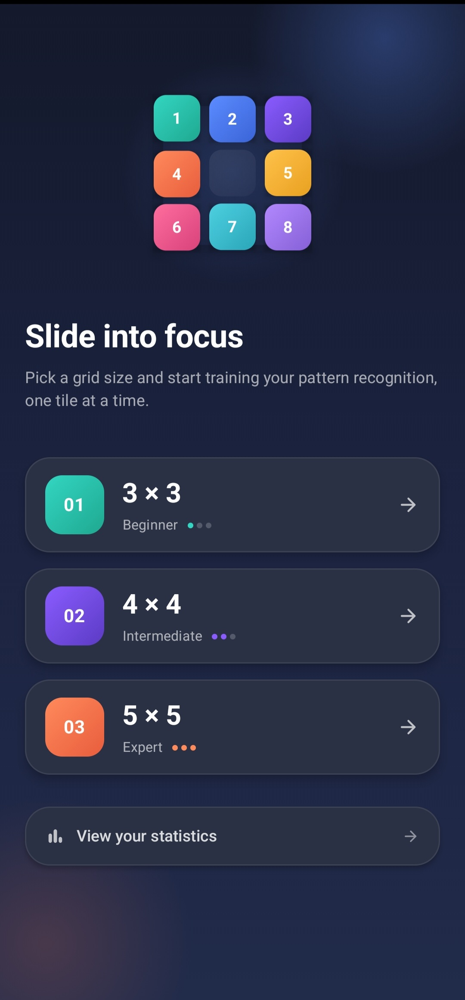
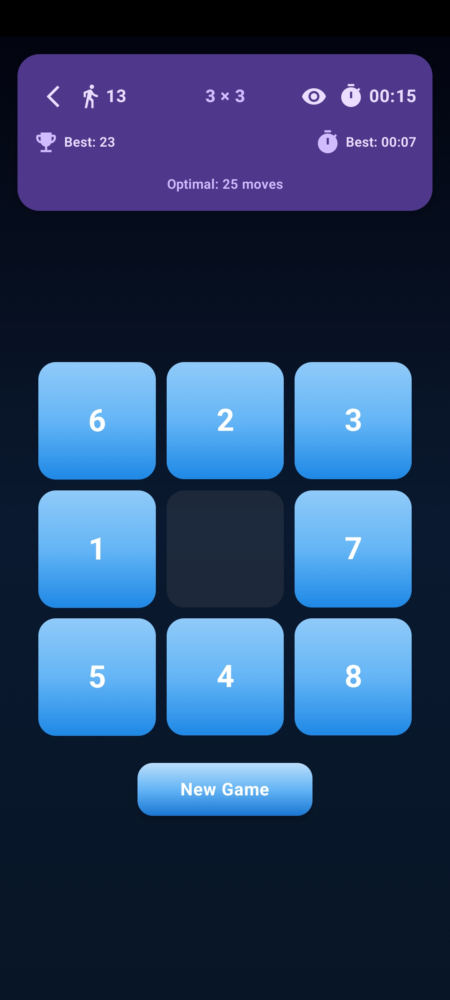
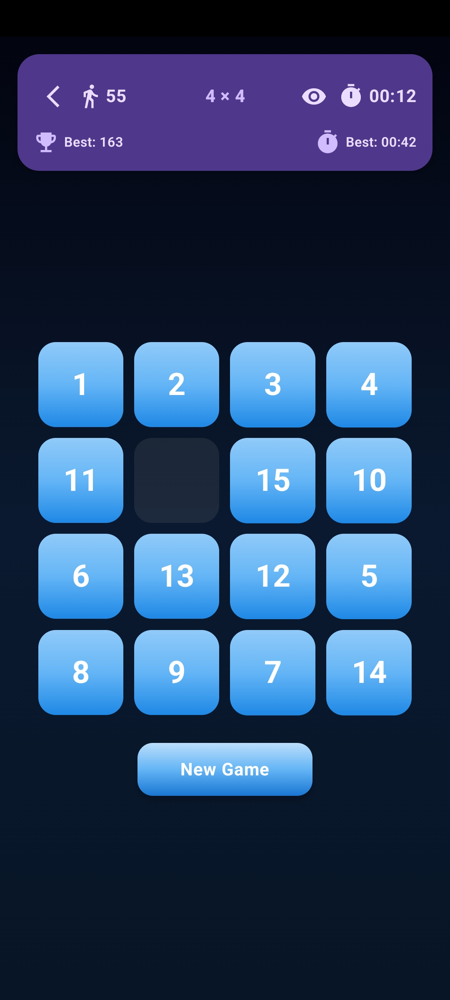
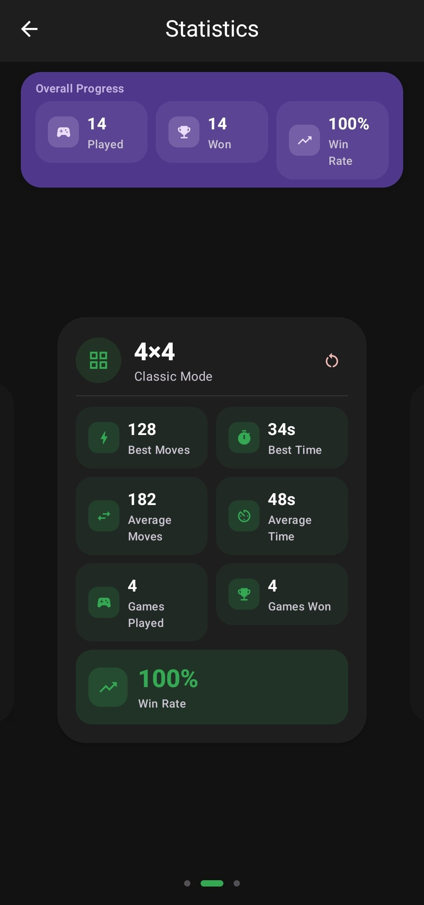
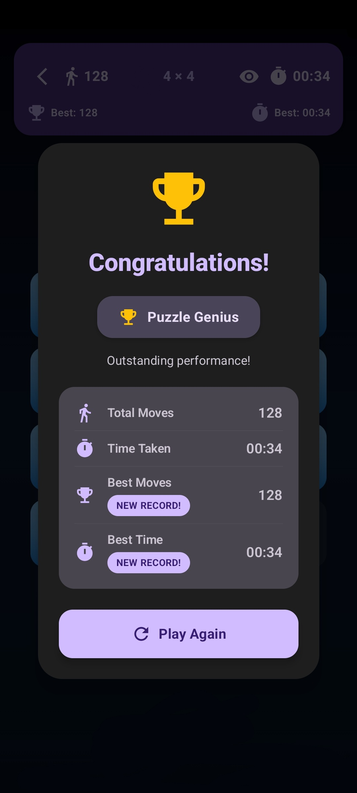

# 🧩 Eight Puzzle

A modern Android sliding puzzle game built with **Kotlin**, **Jetpack Compose**, and **Material 3**.

---

# 📱 Screenshots

## Home Screen

  

---

## Gameplay

  
  

---

## Statistics

  

---

## Win Screen

  

---

# ✨ Features

- 🎮 Classic sliding puzzle gameplay
- 📐 Three puzzle sizes:
    - 3×3
    - 4×4
    - 5×5
- 🤖 A* Solver for the 3×3 puzzle
- 📊 Best moves and best time tracking
- 📈 Statistics for each puzzle size
- 🌙 Light & Dark theme support
- 📱 Works completely offline
- 🚫 No advertisements

---

# 🧠 A* Solver

The application includes an **A* Search Algorithm** that calculates the optimal solution for the classic **3×3 puzzle** using the Manhattan Distance heuristic.

> **Note:** The A* Solver is available **only for the 3×3 mode**.

---

# 📊 Statistics

The application tracks:

- Games Played
- Games Won
- Win Rate
- Best Moves
- Best Time
- Average Moves
- Average Time

Statistics are maintained separately for each puzzle size.

---

# 🛠 Tech Stack

- Kotlin
- Jetpack Compose
- Material 3
- MVVM Architecture
- Android SDK

---

# 👨‍💻 Developer

**Aarush Bhardwaj**

GitHub: https://github.com/Aarush-0801

---

